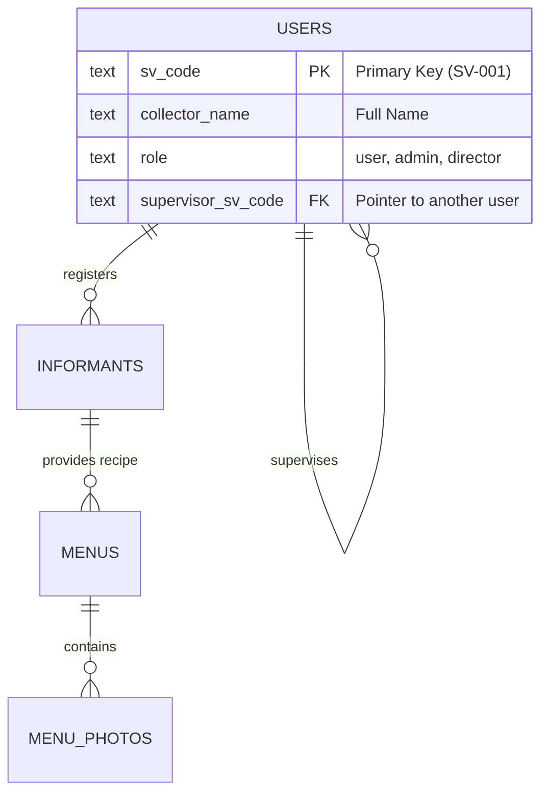

# 🍛 Soft Power Food - Digital Heritage System

[](https://nextjs.org/)
[](https://supabase.com/)
[](https://tailwindcss.com/)
[](https://www.typescriptlang.org/)

ระบบบริหารจัดการและจัดเก็บข้อมูลมรดกภูมิปัญญาทางวัฒนธรรมด้านอาหาร (Soft Power Food) ในพื้นที่แนวคูคลอง มุ่งเน้นการเก็บข้อมูลอย่างเป็นระบบ ใช้งานง่าย และรองรับโครงสร้างการบริหารจัดการทีมแบบลำดับชั้น (Supervisor Hierarchy)

---

## 🌟 ฟีเจอร์หลัก (Core Features)

### 1. 👥 ระบบลำดับชั้นและการบริหารจัดการทีม (Hierarchy System)
ออกแบบมาเพื่อรองรับการทำงานของหน่วยเก็บข้อมูลที่มีโครงสร้างชัดเจน:
- **Supervisor & Subordinates**: กำหนดความสัมพันธ์แบบหัวหน้า-ลูกน้อง (Self-referencing Foreign Key)
- **"ทีมของฉัน" (My Team Dashboard)**: 
    - หน้าจอ Dashboard สำหรับ Admin และ Director เพื่อจัดการลูกทีม
    - **Smart Management**: สามารถดึงตัวผู้ใช้งานที่ยังไม่มีสังกัด (Unassigned) เข้าทีม หรือนำสมาชิกเดิมออกจากทีมได้ทันที
    - **Compact UI**: ออกแบบการ์ดรายการให้ประหยัดพื้นที่ด้วยระบบ Scrolling และมีช่องค้นหา (Search) ที่รวดเร็ว
- **Role-Based Visibility**: 
    - **Director**: ดูแลภาพรวมทั้งหมด กำหนดหัวหน้า-ลูกน้องได้ทั่วถึงระบบ
    - **Admin**: จัดการลูกทีมในสังกัด และดึงสมาชิกอิสระเข้าสู่ทีม
    - **User**: สมาชิกผู้ลงพื้นที่เพื่อเก็บข้อมูลดิบ

### 2. 📝 ระบบแบบสำรวจ 7 ขั้นตอน (Comprehensive Survey)
- **พิกัดและพยาน (Informant)**: บันทึกข้อมูลปราชญ์ท้องถิ่นพร้อมปักหมุดแผนที่ (Interactive Map Picker) และเอกสาร PDPA
- **ขั้นตอนและวัตถุดิบ**: ระบบเพิ่มรายการแบบ Dynamic สำหรับวัตถุดิบและขั้นตอนการปรุงที่ละเอียด
- **คุณสมบัติอาหาร**: บันทึกปริมาณหน่วยบริโภค (Serving Size), ความนิยม, และความเชื่อที่เกี่ยวข้อง
- **อัลบั้มภาพ**: รองรับการเพิ่มภาพประกอบหลายจุด พร้อมระบบบีบอัดภาพฝั่ง Client เพื่อความเร็วในการอัปโหลด

### 3. 🍱 คลังข้อมูลมรดกอาหาร (Food Inventory)
- **Advanced Filtering**: กรองข้อมูลตาม "คลอง" (บางเขน, เปรมประชากร, ลาดพร้าว), หมวดหมู่ และสถานะ
- **Rich Detail View**: หน้าแสดงรายละเอียดที่สวยงาม รวบรวมข้อมูลทั้งหมดไว้ในที่เดียวเพื่อการตรวจสอบ (Director Review)
- **Note System**: ระบบบันทึกข้อความเพิ่มเติมจากหน้าตารางสรุป

### 4. 🎨 Human-Centered Design
- **Paper Theme**: ใช้พื้นหลังโทนสีครีมอุ่น `#fdfbf7` เพื่อลดภาระสายตาสำหรับผู้สูงอายุ
- **High Contrast**: ออกแบบให้มองเห็นชัดเจนแม้อยู่กลางแจ้ง (Field Work Ready)
- **Performance**: รองรับ Turbopack เพื่อการพัฒนาและโหลดหน้าที่รวดเร็ว

---

## 🛠️ เทคโนโลยี (Technical Stack)

- **Frontend**: [Next.js 15](https://nextjs.org/) (App Router)
- **Database / Storage**: [Supabase](https://supabase.com/) (PostgreSQL & Bucket Storage)
- **Authentication**: [NextAuth.js v5](https://authjs.dev/) (Credentials Provider)
- **Styling**: Tailwind CSS 4.0
- **Icons**: Iconify (ชุด Solar Icons)

---

## 📂 โครงสร้างฐานข้อมูล (Database Schema)

ระบบใช้ความสัมพันธ์แบบ **Self-Join** ในตาราง `users` เพื่อสร้างโครงสร้างทีม:


---

## ⚙️ การติดตั้ง (Setup Guide)

### 1. Database Setup
รันคำสั่งในไฟล์ `scripts/setup_schema.sql` ใน Supabase SQL Editor โดยตรง เพื่อสร้างตารางและ Constraints

### 2. Environment Configuration
สร้างไฟล์ `.env.local` และกำหนดค่าดังนี้:
```env
NEXT_PUBLIC_SUPABASE_URL=...
NEXT_PUBLIC_SUPABASE_ANON_KEY=...
SUPABASE_SERVICE_ROLE_KEY=...
AUTH_SECRET=...
NEXTAUTH_URL=http://localhost:3000
```

### 3. Local Development
```bash
npm install
npm run dev
```

---

## 📊 แผนการพัฒนาต่อไป (Roadmap)
- [ ] ระบบวิเคราะห์แนวโน้มการบริโภคอาหาร Soft Power
- [ ] ระบบส่งออกรายงาน Word/PDF สรุปรายเมนู
- [ ] ฟังก์ชัน Offline Sync สำหรับการลงพื้นที่ที่ไม่มีสัญญาณอินเทอร์เน็ต

---
**Soft Power Food Project** - สร้างสรรค์โดยมุ่งเน้นการอนุรักษ์คุณค่าผ่านเทคโนโลยีที่เข้าถึงง่าย 🇹🇭
